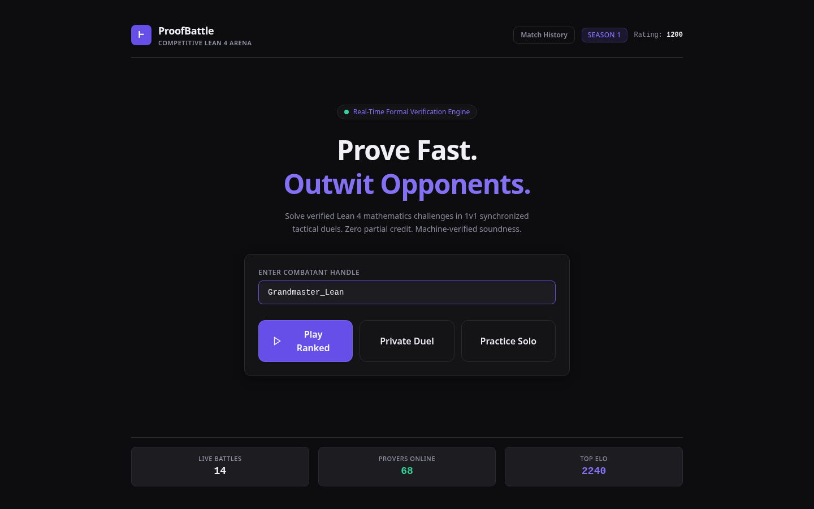
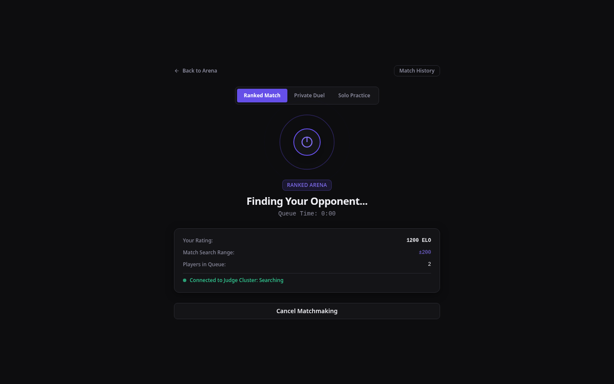
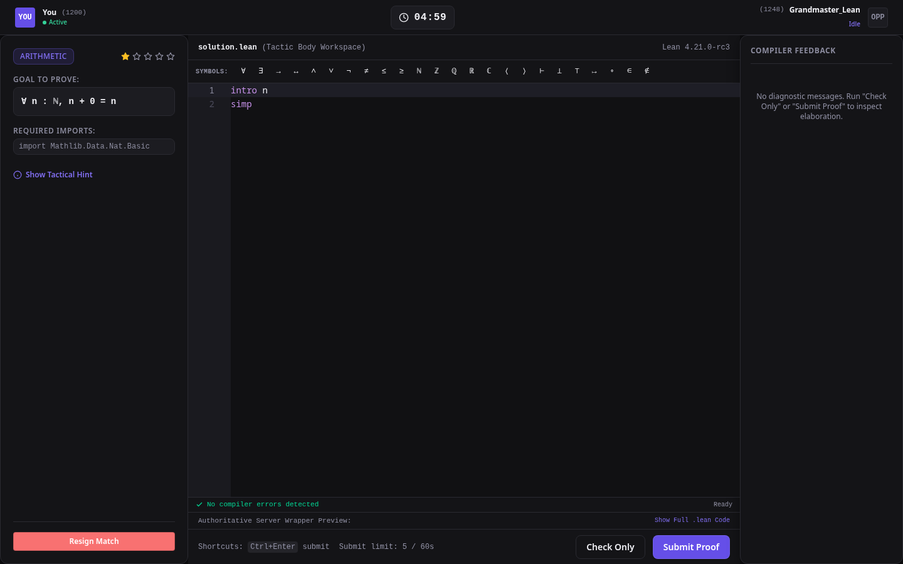
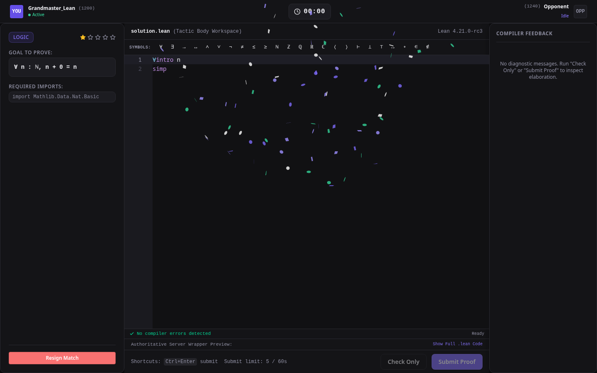
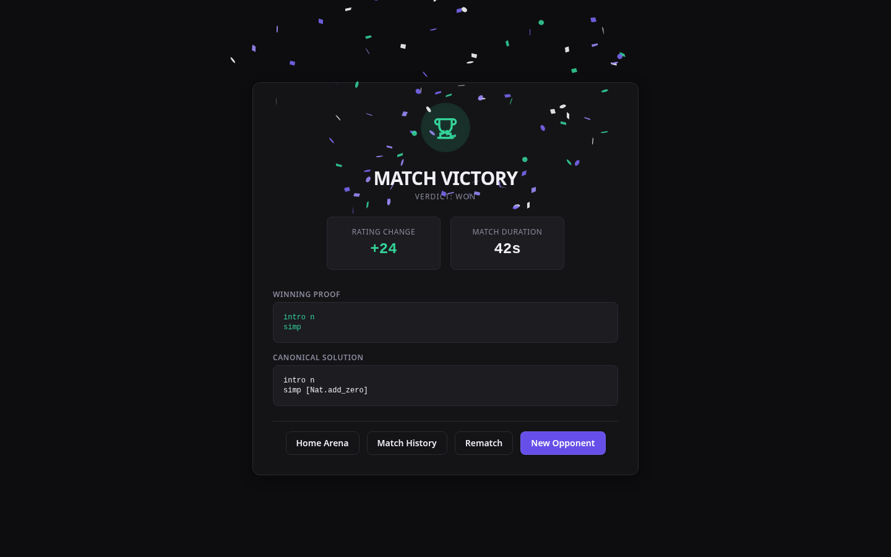
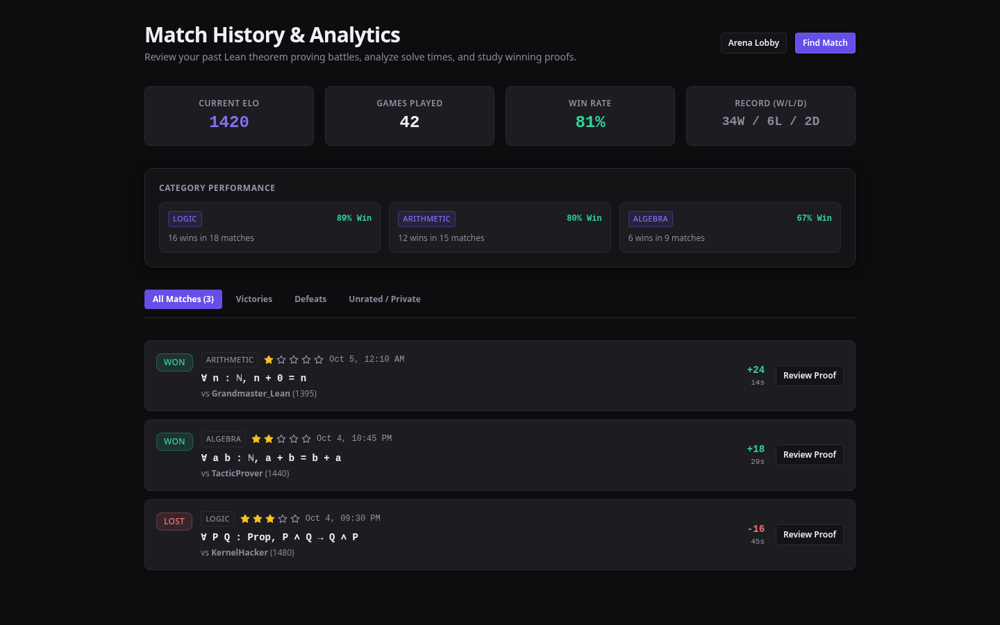
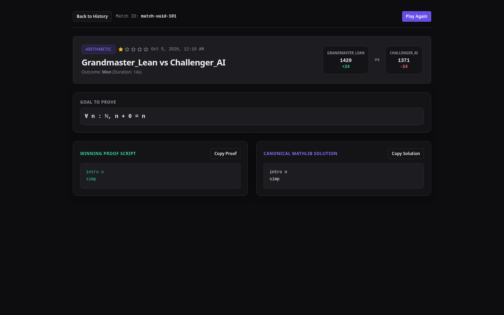

# ProofBattle

ProofBattle is a real-time competitive platform for formal mathematics. Two players receive identical mathematical propositions and race to construct machine-checked proofs in Lean 4. There is no partial credit, no heuristic evaluation, and no subjective review. If Lean accepts the proof without unproven axioms or compiler downgrades, the theorem is verified.

A solo sandbox mode is also provided, allowing players to practice against an automated solver bot.

If you are new to writing proofs in Lean 4, read the practical guide:
- [Lean 4 Proof Guide](learn/README.md)

---

## Interface and User Flow

### 1. Landing and Game Mode Selection

The landing interface provides player handle configuration and access to three modes: Ranked Ladder, Solo Practice, and Private Duel. Real-time indicators display connection state and server health.



### 2. Ranked Matchmaking and Private Rooms

Selecting Ranked Mode places the player into an Elo-bracketed queue. The interface displays search duration and dynamic rating search windows. Players can also switch to Private Room mode to create or join duels using 6-character room codes.




### 3. Live 1v1 Battle Arena

When two players are paired, both enter the split-view arena. The view renders the formal Lean 4 goal statement, required Mathlib imports, a synchronized countdown timer, opponent progress indicators, and an embedded Monaco code editor pre-populated with the proof stub.



### 4. Unicode Math Palette and Compiler Diagnostics

The editor includes a Lean 4 mathematical symbol toolbar (`∀`, `∃`, `→`, `∧`, `∨`, `¬`, `↔`, `ℕ`, `ℤ`, `ℝ`, `⊢`, `≤`, `≥`, `≠`). Syntax errors and type mismatches generate inline editor squiggles and structured diagnostics in the feedback panel, with line numbers adjusted to match user input.


### 5. Victory Resolution and Post-Match Analysis

Submitting a formally verified proof closes the round. The victory modal displays the winner and updated Elo ratings. The results page provides a side-by-side comparison between the submitted proof and the canonical Mathlib solution.





### 6. Performance Analytics and Match History

The history dashboard tracks player statistics over time, including current rating, win rate, active win streak, rating tier badges, and past match records with replay links.



### 7. Interactive Proof Replay

The replay viewer allows users to review finished matches, inspect both players' submitted tactic scripts, and examine the canonical solution.



---

## System Architecture

```text
               +----------------------------------------------------+
               |                Browser Client                      |
               |  SvelteKit 2 + Svelte 5 Runes + Tailwind CSS v4    |
               |  Monaco Editor (Offline Zero-CDN Bundle)           |
               +-------------------------+--------------------------+
                                         |
                                         | WebSocket (/ws)
                                         v
               +----------------------------------------------------+
               |             ProofBattle Server (Rust)              |
               |           Axum + Tokio Async Runtime               |
               +----+--------------------+---------------------+----+
                    |                    |                     |
                    v                    v                     v
            +---------------+    +---------------+    +-----------------+
            | Connection &  |    | Matchmaker &  |    | Two-Lane Queue  |
            | Session Store |    | Dynamic Elo   |    | Rate Limiter    |
            +---------------+    +---------------+    +--------+--------+
                                                               |
                                                               v
                                                      +-----------------+
                                                      | Lexical Filter  |
                                                      +--------+--------+
                                                               |
                                                               v
                                                      +-----------------+
                                                      | Lean 4 Judge    |
                                                      | Sandbox Pool    |
                                                      +-----------------+
```

### Core Subsystems

1. **Protocol and Session Management**:
   Handles WebSocket connections, session token generation, 15-second heartbeat intervals, and connection states. If a player disconnects during a match, a 10-second grace window allows reconnection without losing match state.

2. **Matchmaker and Elo Rating**:
   Pairs players using an expanding rating search window (+/- 150 Elo initially, widening every 5 seconds). Implements standard Elo calculations with tiered K-factors:
   - Provisional (under 10 matches): K = 40
   - Intermediate (10 to 30 matches): K = 32
   - Established (over 30 matches): K = 24

3. **Two-Lane Verification Queue**:
   Separates final submissions from background editor checks:
   - **Submit Lane**: Bounded priority queue. Final submissions acquire dedicated compiler worker permits.
   - **Check Lane**: Non-blocking lane. Background syntax checks use non-blocking acquisition. If compiler workers are saturated, background checks are dropped immediately without stalling final submissions.
   - Submissions are capped at 5 per 60 seconds; checks are capped at 1 per 2 seconds.

4. **Lexical Pre-Filter and AST Security**:
   Before writing code to disk or spawning compiler processes, `server/src/lean/filter.rs` verifies the submission:
   - Rejects inputs over 120 lines or 10,000 bytes.
   - Strips comments and string literals.
   - Blocks forbidden keywords and commands (`sorry`, `sorryAx`, `#eval`, `#check`, `axiom`, `unsafe`, `initialize`, `macro_rules`, `set_option`, `def`, `attribute`).

5. **Sandbox and Execution Harness**:
   Wraps the user tactic script into an immutable verification template:
   ```lean
   <server-controlled-imports>

   set_option autoImplicit false

   theorem proofbattle_goal : <server-controlled-goal> := by
     <user-tactic-body>
   ```
   The compiler runs with Linux seccomp filtering, memory caps via `setrlimit` (RLIMIT_AS), CPU time limits, and a 15-second wall-clock timeout enforced by SIGKILL.

6. **Frontend Editor Integration**:
   Built with SvelteKit 2 and Svelte 5 runes. Monaco Editor is bundled locally via Vite worker imports with zero third-party CDN dependencies. Includes custom syntax highlighting for Lean 4, LaTeX slash-completion, and compiler diagnostic remapping.

---

## Security Defenses

ProofBattle executes untrusted user code against a formal verification system. The platform implements defenses across multiple layers:

- **WebSocket Frame Bounding**: Incoming messages are capped at 64 KiB, preventing memory allocation exhaustion from oversized payloads.
- **Handshake Timeout**: Unauthenticated sockets that fail to complete the initial `Hello` handshake within 10 seconds are terminated, preventing socket pool exhaustion.
- **Persistent Rate Limiting**: Token bucket counters persist across socket reconnections, preventing clients from evading submission quotas by reconnecting. Refilled buckets are cleaned up via periodic garbage collection.
- **AST and Token Validation**: Environment-altering commands, metaprogramming macros, and option overrides are blocked at the lexical layer before compiler execution.
- **Process and Sandbox Isolation**: Verification processes execute under restricted system privileges with memory limits, strict execution timeouts, and container-level sandbox policies.

---

## Repository Layout

```text
proof_battle/
├── Cargo.toml               # Workspace manifest
├── Makefile                 # Development shortcuts
├── README.md                # Project documentation
├── learn/                   # Lean 4 proof writing tutorial
│   └── README.md
├── docs/                    # Technical designs, protocols, and architecture specs
│   ├── PROTOCOL.md          # WebSocket protocol specification
│   ├── ANTI_CHEAT.md        # Security threat model and defenses
│   └── LOCAL_SETUP.md       # Detailed local environment setup
├── screenshots/             # UI walkthrough captures
├── server/                  # Rust backend service
│   ├── Cargo.toml
│   ├── migrations/          # SQLite schema migrations
│   ├── src/
│   │   ├── config.rs        # Configuration and environment validation
│   │   ├── db/              # Problem catalogs and match history queries
│   │   ├── game/            # Room actors, matchmaking, Elo, queue
│   │   ├── lean/            # Lexical filter, sandbox runner, wrapper
│   │   ├── metrics.rs       # Prometheus telemetry metrics
│   │   └── ws/              # Protocol types and message handling
│   └── tests/               # Integration, protocol, and corpus tests
├── frontend/                # SvelteKit web client
│   ├── src/
│   │   ├── lib/
│   │   │   ├── components/  # Arena UI, modals, timers, badges
│   │   │   ├── editor/      # Monaco integration and Unicode palette
│   │   │   ├── stores/      # Svelte 5 reactive stores
│   │   │   └── ws/          # WebSocket client state machine
│   │   └── routes/          # Application routes (/, /lobby, /game, /history, /replay)
│   └── e2e/                 # Playwright test suite
├── infra/                   # Deployment and operational configuration
│   ├── docker-compose.yml   # Multi-service composition
│   ├── nginx/               # Reverse proxy configuration with SSL termination
│   └── monitoring/          # Prometheus and Grafana dashboards
└── scripts/                 # Problem extraction and benchmarking utilities
```

---

## Getting Started

### Prerequisites

- Rust 1.80 or higher
- Node.js 20 or higher with npm
- Lean 4 toolchain (installed via `elan`)

### 1. Start the Backend Server

The backend defaults to port 3000, or port 3001 if specified:

```bash
BIND_ADDR="127.0.0.1:3001" cargo run --bin proof-battle-server
```

When ready, the server logs:
```text
ProofBattle server running on ws://127.0.0.1:3001/ws
```

### 2. Start the Frontend Client

The frontend development server proxies `/ws` and `/api` requests to the backend:

```bash
cd frontend
npm install
npm run dev -- --port 5173
```

Open your browser to:
```text
http://localhost:5173
```

### 3. Running with Docker Compose

To start the full stack including Prometheus, Grafana, Nginx, and the ProofBattle service:

```bash
docker compose -f infra/docker-compose.yml up --build
```

---

## Verification and Testing

### Backend Test Suite (110 Tests)

Run all unit, integration, and security tests:

```bash
cargo test --manifest-path server/Cargo.toml
```

Test coverage includes:
- Lexical filter validation and AST keyword rejection
- Room actor state machines and concurrent proof submissions
- Session resumption within the 10-second grace window
- Rate limiter persistence and garbage collection
- 100-game soak test checking memory stability and actor termination

### Frontend Test Suite

Run unit tests with Vitest:

```bash
cd frontend
npm run test:unit -- --run
```

Run TypeScript and Svelte diagnostics:

```bash
cd frontend
npm run check
```

Run end-to-end browser tests:

```bash
cd frontend
npx playwright test
```

### Code Style and Linting

```bash
# Rust static analysis and formatting
cargo clippy --manifest-path server/Cargo.toml --all-targets -- -D warnings
cargo fmt --all -- --check

# Frontend linting
cd frontend
npm run lint
```

---

## WebSocket Protocol Summary

All communication uses JSON frames with a top-level `type` field.

### Client Messages

- `Hello { version, token, username }`: Initiates connection or requests session reattachment.
- `QueueJoin {}`: Enters the ranked matchmaking queue.
- `QueueLeave {}`: Cancels matchmaking search.
- `PracticeJoin {}`: Starts a solo game against the practice bot.
- `CreatePrivateRoom {}`: Creates a private duel room with a 6-character code.
- `JoinPrivateRoom { code }`: Joins an existing private duel room.
- `ProofRequest { req_id, code, intent }`: Dispatches code for `Check` or `Submit`.
- `Resign {}`: Concedes the match.
- `Pong { ts }`: Heartbeat response.

### Server Messages

- `Welcome { player_id, session_token, server_time_ms, heartbeat_interval_ms, protocol_version }`: Confirms connection and credentials.
- `QueueStatus { queue_size, elo, search_range }`: Periodic matchmaking status.
- `MatchFound { room_id, you, opponent }`: Emitted when an opponent is assigned.
- `RoundStart { room_id, problem, starts_at_ms, ends_at_ms, duration_ms, server_time_ms, seq }`: Delivers the goal and starts the clock.
- `Verdict { req_id, verdict, reason, message, diagnostics, elapsed_ms, check_skipped }`: Returns compiler output and line markers.
- `RoundEnd { room_id, outcome, winner_id, winning_proof, canonical_proof, elo_delta, duration_ms, seq }`: Concludes the match.
