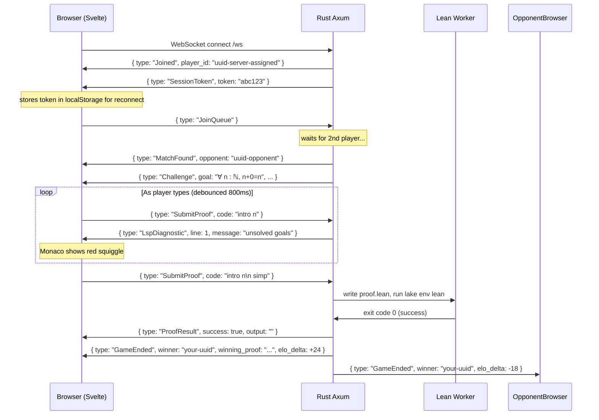

# ProofBattle — Frontend Engineering Design Document

> **Perspective**: Written as a Senior Frontend Engineer who has shipped competitive real-time products. Every decision here is made with the same seriousness as a Leetcode, Codeforces, or Figma — products where the editor IS the product.

---

## Table of Contents

1. [Tech Stack Decision](#1-tech-stack-decision)
2. [Design System](#2-design-system)
3. [Screen-by-Screen Layout](#3-screen-by-screen-layout)
4. [The Code Playground — Why Monaco, How It Works](#4-the-code-playground--why-monaco-how-it-works)
5. [Component Architecture](#5-component-architecture)
6. [WebSocket State Machine](#6-websocket-state-machine)
7. [Frontend ↔ Rust Backend Communication Contract](#7-frontend--rust-backend-communication-contract)
8. [State Management](#8-state-management)
9. [Live Lean Feedback (LSP Streaming)](#9-live-lean-feedback-lsp-streaming)
10. [Performance & UX Details](#10-performance--ux-details)
11. [File Structure](#11-file-structure)

---

## 1. Tech Stack Decision

### Why SvelteKit (not React/Next)

| Concern | React + Next | SvelteKit |
|---|---|---|
| Bundle size | ~130KB base | ~12KB base |
| Reactivity model | Virtual DOM diffing | Compiled, direct DOM updates |
| State management | Redux / Zustand / Context hell | Svelte stores (built-in, simple) |
| WebSocket + reactive UI | Painful with useEffect | Natural — `$:` reactive declarations |
| Monaco integration | Works fine | Works fine |
| Real-time UI updates | Re-render overhead | Fine-grained, zero overhead |
| Learning curve for Lean devs | Steep | Minimal |

For a real-time competitive game where the editor state, WebSocket events, opponent status, and timer all need to react to each other — Svelte's compiled reactivity is the cleanest model. No `useEffect` dependency arrays. No stale closures.

### Final Stack

```
Framework:        SvelteKit (SSR + client routing)
Code Editor:      Monaco Editor (@monaco-editor/loader)
Math Rendering:   KaTeX (theorem goal display)
Styling:          Tailwind CSS v4 + CSS custom properties
Fonts:            JetBrains Mono (code), Inter (UI)
Icons:            Lucide Svelte
Animations:       CSS keyframes + Svelte transitions
WebSocket:        Native browser WebSocket API
Build:            Vite (SvelteKit's default)
Type Safety:      TypeScript throughout
Testing:          Playwright (e2e), Vitest (unit)
```

---

## 2. Design System

### 2.1 — Color Palette

The aesthetic should feel like a **dark math terminal meets a competitive esport arena**. Not neon gamer. Clean, serious, with accent color used sparingly.

```css
/* tokens.css — imported everywhere */
:root {
  /* Backgrounds */
  --bg-base:        #0d0d0f;   /* deep near-black */
  --bg-surface:     #141417;   /* panels */
  --bg-elevated:    #1c1c21;   /* editor bg, cards */
  --bg-overlay:     #242429;   /* dropdowns, modals */
  --bg-border:      #2a2a31;   /* subtle dividers */

  /* Text */
  --text-primary:   #f0f0f5;   /* main content */
  --text-secondary: #8b8b9e;   /* labels, metadata */
  --text-muted:     #4a4a5a;   /* placeholders */

  /* Accent — electric indigo */
  --accent:         #7c6af7;   /* primary CTA, highlights */
  --accent-dim:     #7c6af720; /* subtle bg tint */
  --accent-bright:  #9d8fff;   /* hover states */

  /* Semantic */
  --success:        #34d399;   /* proof accepted */
  --error:          #f87171;   /* proof rejected */
  --warning:        #fbbf24;   /* timer low */
  --info:           #60a5fa;   /* neutral feedback */

  /* Editor-specific */
  --editor-bg:      #111113;
  --editor-gutter:  #1a1a1f;
  --editor-line-hl: #1e1e26;
  --editor-cursor:  #7c6af7;

  /* Typography scale */
  --font-mono:      'JetBrains Mono', 'Fira Code', monospace;
  --font-ui:        'Inter', system-ui, sans-serif;
}
```

### 2.2 — Typography

```css
/* Proof goal display — large, beautiful math */
.proof-goal {
  font-family: var(--font-mono);
  font-size: 1.25rem;
  line-height: 1.8;
  color: var(--text-primary);
  letter-spacing: -0.01em;
}

/* KaTeX rendered goal */
.katex-goal .katex {
  font-size: 1.4rem;
  color: var(--text-primary);
}

/* Status labels */
.status-label {
  font-family: var(--font-ui);
  font-size: 0.75rem;
  font-weight: 600;
  text-transform: uppercase;
  letter-spacing: 0.08em;
  color: var(--text-secondary);
}
```

### 2.3 — Spacing & Layout Grid

```css
/* 8pt grid system */
--space-1:  4px;
--space-2:  8px;
--space-3:  12px;
--space-4:  16px;
--space-6:  24px;
--space-8:  32px;
--space-12: 48px;
--space-16: 64px;

/* Border radius */
--radius-sm: 4px;
--radius-md: 8px;
--radius-lg: 12px;
--radius-xl: 16px;
```

### 2.4 — Component Design Tokens

```css
/* Buttons */
.btn-primary {
  background: var(--accent);
  color: white;
  padding: var(--space-3) var(--space-6);
  border-radius: var(--radius-md);
  font-weight: 600;
  font-size: 0.9rem;
  border: none;
  cursor: pointer;
  transition: background 150ms ease, transform 100ms ease;
}
.btn-primary:hover  { background: var(--accent-bright); }
.btn-primary:active { transform: scale(0.98); }

/* Cards / Panels */
.panel {
  background: var(--bg-surface);
  border: 1px solid var(--bg-border);
  border-radius: var(--radius-lg);
}
```

---

## 3. Screen-by-Screen Layout

### 3.1 — Landing / Home Screen

```
┌─────────────────────────────────────────────────────────────┐
│                                                             │
│                    ⊢ ProofBattle                           │
│            Competitive Lean Theorem Proving                 │
│                                                             │
│         ┌──────────────────────────────────┐               │
│         │  Enter username                  │               │
│         └──────────────────────────────────┘               │
│                                                             │
│         ┌──────────────┐  ┌──────────────┐                 │
│         │  ⚔️  Play Now  │  │  📚 Practice  │                 │
│         └──────────────┘  └──────────────┘                 │
│                                                             │
│    ──────────────────────────────────────────               │
│    Live Games: 12    Players Online: 47    Top ELO: 2140    │
│                                                             │
└─────────────────────────────────────────────────────────────┘
```

### 3.2 — Matchmaking Screen

```
┌─────────────────────────────────────────────────────────────┐
│                                                             │
│                  Finding your opponent...                   │
│                                                             │
│              ●  ●  ●  (animated pulse)                     │
│                                                             │
│         Your ELO: 1024 — searching ±150 range              │
│                                                             │
│              [  Cancel  ]                                   │
│                                                             │
└─────────────────────────────────────────────────────────────┘
```

### 3.3 — Game Screen (The Core Interface)

```
┌──────────────────────────────────────────────────────────────┐
│ ⊢ ProofBattle   gulshan (1024) ──── vs ──── opponent (1087) │
│                          ⏱ 07:23                            │
├───────────────────┬──────────────────────┬───────────────────┤
│                   │                      │                   │
│   PROBLEM         │   YOUR PROOF         │   BATTLE STATUS   │
│   ───────         │   ─────────          │   ────────────    │
│                   │                      │                   │
│   Difficulty: ★★☆ │  1  theorem goal :   │  YOU              │
│   Category: Logic │  2    ∀ n : ℕ,      │  ✏️ Editing        │
│                   │  3      n + 0 = n := │                   │
│   Prove:          │  4    by             │  OPPONENT         │
│                   │  5    intro n ▌      │  ✏️ Typing...      │
│   ∀ n : ℕ,        │                      │                   │
│     n + 0 = n     │                      │  ─────────────    │
│                   │  ┌────────────────┐  │                   │
│   (KaTeX render)  │  │ ⚠ Line 5:      │  │  Submissions      │
│                   │  │ unknown tactic │  │  You:      2 ❌   │
│   💡 Hint         │  └────────────────┘  │  Opponent: 1 ❌   │
│   simp, omega     │                      │                   │
│                   │  [ Submit Proof ]    │                   │
│                   │                      │                   │
└───────────────────┴──────────────────────┴───────────────────┘
```

### 3.4 — Result Modal (Winner)

```
┌─────────────────────────────┐
│                             │
│   🏆  YOU WIN!              │
│                             │
│   Time: 2m 14s              │
│   ELO:  +24  (now 1048)     │
│                             │
│   Winning proof:            │
│   ┌─────────────────────┐   │
│   │ intro n; simp       │   │
│   └─────────────────────┘   │
│                             │
│   Canonical solution:       │
│   ┌─────────────────────┐   │
│   │ intro n             │   │
│   │ rfl                 │   │
│   └─────────────────────┘   │
│                             │
│  [Rematch]  [New opponent]  │
│                             │
└─────────────────────────────┘
```

---

## 4. The Code Playground — Why Monaco, How It Works

### 4.1 — Why Monaco Editor (not CodeMirror, not textarea)

| Option | Pros | Cons | Decision |
|---|---|---|---|
| `<textarea>` | Zero deps | No syntax highlighting, no LSP, unusable | ❌ Rejected |
| CodeMirror 6 | Lightweight (50KB), modular | Lean support community-built, less polish | ⚠️ Viable |
| Monaco Editor | VS Code engine, mature, excellent LSP protocol support, Lean extension already exists in VSCode | 4MB bundle (lazy loaded) | ✅ **Chosen** |
| Lean4 Web | Full Lean in browser via WASM | 150MB+ WASM download, kills mobile, extremely slow | ❌ Rejected for multiplayer |

**Monaco is the correct answer** because:
1. Players already know it from VS Code + lean4 extension
2. It natively speaks the LSP protocol — you can wire it to stream diagnostics from the server
3. Lean4 has a TextMate grammar file that Monaco can load directly
4. It handles Unicode input (`\forall` → `∀`) the same way VS Code does

### 4.2 — Monaco Integration in SvelteKit

```typescript
// src/lib/editor/MonacoEditor.svelte
<script lang="ts">
  import { onMount, onDestroy, createEventDispatcher } from 'svelte';
  import { loader } from '@monaco-editor/loader';
  import type * as Monaco from 'monaco-editor';

  export let value: string = '';
  export let readonly: boolean = false;
  export let diagnostics: LeanDiagnostic[] = [];

  const dispatch = createEventDispatcher<{ change: string }>();

  let container: HTMLDivElement;
  let editor: Monaco.editor.IStandaloneCodeEditor;
  let monaco: typeof Monaco;
  let decorations: Monaco.editor.IEditorDecorationsCollection;

  onMount(async () => {
    // Lazy-load Monaco — 4MB, don't block initial render
    monaco = await loader.init();

    // Register Lean4 language
    monaco.languages.register({ id: 'lean4' });

    // Load TextMate grammar for syntax highlighting
    monaco.languages.setMonarchTokensProvider('lean4', getLean4Grammar());

    // Configure editor theme
    monaco.editor.defineTheme('proofbattle-dark', getEditorTheme());

    editor = monaco.editor.create(container, {
      value,
      language: 'lean4',
      theme: 'proofbattle-dark',
      readOnly: readonly,
      fontSize: 14,
      fontFamily: 'JetBrains Mono, Fira Code, monospace',
      fontLigatures: true,
      lineNumbers: 'on',
      minimap: { enabled: false },
      scrollBeyondLastLine: false,
      wordWrap: 'on',
      bracketPairColorization: { enabled: true },
      suggest: { showKeywords: true },
      unicodeHighlight: { ambiguousCharacters: false }, // ∀ ∃ ℕ are fine
      renderLineHighlight: 'all',
      cursorBlinking: 'smooth',
      cursorSmoothCaretAnimation: 'on',
      padding: { top: 16, bottom: 16 },
    });

    // Emit content changes (debounced for LSP)
    editor.onDidChangeModelContent(() => {
      dispatch('change', editor.getValue());
    });

    decorations = editor.createDecorationsCollection();
  });

  // Reactively update diagnostics → red squiggles
  $: if (editor && diagnostics) {
    applyDiagnostics(diagnostics);
  }

  function applyDiagnostics(diags: LeanDiagnostic[]) {
    const markers: Monaco.editor.IMarkerData[] = diags.map(d => ({
      severity: d.severity === 'error'
        ? monaco.MarkerSeverity.Error
        : monaco.MarkerSeverity.Warning,
      startLineNumber: d.line,
      startColumn: d.col,
      endLineNumber: d.endLine ?? d.line,
      endColumn: d.endCol ?? d.col + 1,
      message: d.message,
      source: 'Lean',
    }));

    monaco.editor.setModelMarkers(
      editor.getModel()!,
      'lean-lsp',
      markers
    );
  }

  export function getValue(): string {
    return editor?.getValue() ?? '';
  }

  export function insertSnippet(text: string) {
    editor.trigger('keyboard', 'type', { text });
  }

  onDestroy(() => editor?.dispose());
</script>

<div bind:this={container} class="editor-container" />

<style>
  .editor-container {
    width: 100%;
    height: 100%;
    min-height: 400px;
  }
</style>
```

### 4.3 — Lean4 Syntax Highlighting Grammar

Monaco uses Monarch (its own tokenizer) or TextMate grammars. Here's the Monarch grammar for Lean4:

```typescript
// src/lib/editor/lean4Grammar.ts
export function getLean4Grammar(): Monaco.languages.IMonarchLanguage {
  return {
    keywords: [
      'theorem', 'lemma', 'def', 'by', 'intro', 'apply', 'exact',
      'simp', 'ring', 'omega', 'linarith', 'nlinarith', 'norm_num',
      'have', 'obtain', 'cases', 'induction', 'constructor', 'use',
      'rfl', 'rw', 'calc', 'show', 'suffices', 'contradiction',
      'assumption', 'trivial', 'decide', 'native_decide',
      'import', 'open', 'namespace', 'end', 'section', 'variable',
      'fun', 'match', 'if', 'then', 'else', 'let', 'in', 'do',
      'return', 'pure', 'Prop', 'Type', 'Sort',
    ],
    typeKeywords: ['ℕ', 'ℤ', 'ℚ', 'ℝ', 'ℂ', 'Bool', 'Fin', 'List', 'Set'],
    operators: [
      ':=', ':', '::', '|', '⟨', '⟩', '←', '→', '↔', '∀', '∃',
      '∧', '∨', '¬', '⊢', '⊥', '⊤', '≤', '≥', '≠', '≡', '⟹',
    ],
    tokenizer: {
      root: [
        [/--.*$/, 'comment'],
        [/\/\-/, 'comment', '@blockComment'],
        [/#\w+/, 'keyword.special'],        // #check, #eval (we show these even though server blocks them)
        [/\b(theorem|lemma|def)\b/, 'keyword.declaration'],
        [/\b(by|do)\b/, 'keyword.control'],
        [/[∀∃∧∨¬→↔⊢⊥⊤≤≥≠≡⟹←]/, 'keyword.operator'],
        [/[ℕℤℚℝℂ]/, 'type.identifier'],
        [/\b[A-Z][a-zA-Z0-9_]*\b/, 'type.identifier'],
        [/\b\d+\b/, 'number'],
        [/"[^"]*"/, 'string'],
        [/`[^`]*`/, 'string.backtick'],
        [/\b[a-z_][a-zA-Z0-9_']*\b/, { cases: { '@keywords': 'keyword', '@default': 'identifier' } }],
      ],
      blockComment: [
        [/-\//, 'comment', '@pop'],
        [/./, 'comment'],
      ],
    },
  };
}
```

### 4.4 — Editor Theme (matches ProofBattle dark palette)

```typescript
export function getEditorTheme(): Monaco.editor.IStandaloneThemeData {
  return {
    base: 'vs-dark',
    inherit: true,
    rules: [
      { token: 'keyword.declaration', foreground: 'c792ea', fontStyle: 'bold' },
      { token: 'keyword.control',     foreground: '7c6af7', fontStyle: 'bold' },
      { token: 'keyword.operator',    foreground: '89ddff' },
      { token: 'keyword',             foreground: 'c792ea' },
      { token: 'type.identifier',     foreground: 'ffcb6b' },
      { token: 'comment',             foreground: '4a4a5a', fontStyle: 'italic' },
      { token: 'number',              foreground: 'f78c6c' },
      { token: 'string',              foreground: 'c3e88d' },
      { token: 'identifier',          foreground: 'f0f0f5' },
    ],
    colors: {
      'editor.background':           '#111113',
      'editor.foreground':           '#f0f0f5',
      'editor.lineHighlightBackground': '#1e1e26',
      'editor.selectionBackground':  '#7c6af740',
      'editorCursor.foreground':     '#7c6af7',
      'editorLineNumber.foreground': '#4a4a5a',
      'editorLineNumber.activeForeground': '#8b8b9e',
      'editorGutter.background':     '#1a1a1f',
      'editorWidget.background':     '#1c1c21',
      'editorSuggestWidget.background': '#1c1c21',
      'editorSuggestWidget.border':  '#2a2a31',
    },
  };
}
```

### 4.5 — Unicode Input Shortcuts

Lean uses Unicode symbols. Players need to type them fast. Implement a key mapper:

```typescript
// src/lib/editor/unicodeMapper.ts
// Triggered on backslash sequences — same as VS Code lean4 extension

const LEAN_UNICODE_MAP: Record<string, string> = {
  'forall': '∀',   'exists': '∃',   'to': '→',
  'iff': '↔',      'and': '∧',      'or': '∨',
  'not': '¬',      'ne': '≠',       'le': '≤',
  'ge': '≥',       'lt': '<',       'gt': '>',
  'nat': 'ℕ',      'int': 'ℤ',      'real': 'ℝ',
  'rat': 'ℚ',      'complex': 'ℂ',  'langle': '⟨',
  'rangle': '⟩',   'vdash': '⊢',    'bot': '⊥',
  'top': '⊤',      'alpha': 'α',    'beta': 'β',
  'lambda': 'λ',   'pi': 'π',       'sigma': 'σ',
  'in': '∈',       'notin': '∉',    'sub': '⊆',
  'sup': '⊇',      'cup': '∪',      'cap': '∩',
};

export function installUnicodeMapper(editor: Monaco.editor.IStandaloneCodeEditor) {
  editor.onKeyDown((e) => {
    if (e.code === 'Space' || e.code === 'Tab') {
      const model = editor.getModel()!;
      const pos = editor.getPosition()!;
      const lineContent = model.getLineContent(pos.lineNumber);
      const textBefore = lineContent.substring(0, pos.column - 1);
      
      // Check for \keyword pattern
      const match = textBefore.match(/\\([a-zA-Z]+)$/);
      if (match) {
        const keyword = match[1].toLowerCase();
        const replacement = LEAN_UNICODE_MAP[keyword];
        if (replacement) {
          e.preventDefault();
          e.stopPropagation();
          
          const start = { lineNumber: pos.lineNumber, column: pos.column - match[0].length };
          const end = pos;
          editor.executeEdits('unicode-mapper', [{
            range: new monaco.Range(start.lineNumber, start.column, end.lineNumber, end.column),
            text: replacement,
          }]);
        }
      }
    }
  });
}
```

---

## 5. Component Architecture

### Component Tree

```
App (SvelteKit layout)
├── routes/
│   ├── +page.svelte              ← Landing page
│   ├── lobby/+page.svelte        ← Matchmaking waiting room
│   └── game/+page.svelte         ← Main game screen
│
└── lib/
    ├── components/
    │   ├── game/
    │   │   ├── GameScreen.svelte        ← Orchestrates game state
    │   │   ├── ProblemPanel.svelte      ← Shows theorem goal
    │   │   ├── EditorPanel.svelte       ← Monaco + submit button
    │   │   ├── StatusPanel.svelte       ← Timer + opponent status
    │   │   ├── DiagnosticsBar.svelte    ← Lean error display
    │   │   └── ResultModal.svelte       ← Win/lose screen
    │   ├── ui/
    │   │   ├── Button.svelte
    │   │   ├── Badge.svelte             ← difficulty stars
    │   │   ├── Spinner.svelte           ← matchmaking pulse
    │   │   ├── Timer.svelte             ← countdown clock
    │   │   └── EloDisplay.svelte
    │   └── editor/
    │       ├── MonacoEditor.svelte      ← Monaco wrapper
    │       ├── UnicodePalette.svelte    ← clickable symbol palette
    │       └── SubmitButton.svelte      ← with loading state
    │
    ├── stores/
    │   ├── gameStore.ts                 ← core game state
    │   ├── wsStore.ts                   ← WebSocket singleton
    │   └── editorStore.ts               ← editor content, diagnostics
    │
    ├── ws/
    │   ├── client.ts                    ← WebSocket class
    │   ├── messages.ts                  ← typed message definitions
    │   └── stateMachine.ts              ← connection state machine
    │
    └── editor/
        ├── MonacoEditor.svelte          ← (as above)
        ├── lean4Grammar.ts
        ├── editorTheme.ts
        └── unicodeMapper.ts
```

### Key Component — `GameScreen.svelte`

This is the orchestrator. It owns the WebSocket and distributes events to child components.

```svelte
<!-- src/routes/game/+page.svelte -->
<script lang="ts">
  import { onMount, onDestroy } from 'svelte';
  import { gameStore } from '$lib/stores/gameStore';
  import { wsClient } from '$lib/ws/client';
  import ProblemPanel from '$lib/components/game/ProblemPanel.svelte';
  import EditorPanel from '$lib/components/game/EditorPanel.svelte';
  import StatusPanel from '$lib/components/game/StatusPanel.svelte';
  import ResultModal from '$lib/components/game/ResultModal.svelte';

  let editorRef: EditorPanel;

  onMount(() => {
    wsClient.connect();
  });

  onDestroy(() => {
    wsClient.disconnect();
  });

  async function handleSubmit() {
    const code = editorRef.getCode();
    gameStore.setSubmitting(true);
    wsClient.submitProof(code);
  }
</script>

<div class="game-layout">
  <header class="game-header">
    <PlayerBar />
    <Timer />
    <OpponentBar />
  </header>

  <main class="game-panels">
    <ProblemPanel goal={$gameStore.challenge?.goal} />
    <EditorPanel bind:this={editorRef} on:submit={handleSubmit} />
    <StatusPanel />
  </main>
</div>

{#if $gameStore.result}
  <ResultModal result={$gameStore.result} />
{/if}

<style>
  .game-layout {
    display: grid;
    grid-template-rows: 56px 1fr;
    height: 100dvh;
    background: var(--bg-base);
    overflow: hidden;
  }

  .game-header {
    display: flex;
    align-items: center;
    justify-content: space-between;
    padding: 0 var(--space-6);
    background: var(--bg-surface);
    border-bottom: 1px solid var(--bg-border);
  }

  .game-panels {
    display: grid;
    grid-template-columns: 280px 1fr 220px;
    gap: 0;
    overflow: hidden;
  }

  @media (max-width: 900px) {
    /* Tablet: stack problem above editor, hide status panel */
    .game-panels {
      grid-template-columns: 1fr;
      grid-template-rows: auto 1fr;
    }
  }
</style>
```

### Key Component — `ProblemPanel.svelte`

```svelte
<!-- src/lib/components/game/ProblemPanel.svelte -->
<script lang="ts">
  import { onMount } from 'svelte';
  import katex from 'katex';

  export let goal: string = '';
  export let difficulty: number = 1;
  export let category: string = '';
  export let hint: string = '';
  export let showHint: boolean = false;

  // Convert Lean Unicode to LaTeX for KaTeX
  function leanToKaTeX(lean: string): string {
    return lean
      .replace(/∀/g, '\\forall\\ ')
      .replace(/∃/g, '\\exists\\ ')
      .replace(/→/g, '\\to ')
      .replace(/↔/g, '\\leftrightarrow ')
      .replace(/∧/g, '\\land ')
      .replace(/∨/g, '\\lor ')
      .replace(/¬/g, '\\neg ')
      .replace(/ℕ/g, '\\mathbb{N}')
      .replace(/ℤ/g, '\\mathbb{Z}')
      .replace(/ℝ/g, '\\mathbb{R}')
      .replace(/≤/g, '\\leq ')
      .replace(/≥/g, '\\geq ')
      .replace(/≠/g, '\\neq ')
      .replace(/⊢/g, '\\vdash ');
  }

  let rendered = '';
  $: {
    try {
      rendered = katex.renderToString(leanToKaTeX(goal), {
        throwOnError: false,
        displayMode: true,
      });
    } catch {
      rendered = `<code>${goal}</code>`;
    }
  }

  $: stars = Array.from({ length: 5 }, (_, i) => i < difficulty);
</script>

<aside class="problem-panel panel">
  <div class="panel-header">
    <span class="status-label">Problem</span>
    <div class="difficulty">
      {#each stars as filled}
        <span class="star" class:filled>★</span>
      {/each}
    </div>
  </div>

  {#if category}
    <span class="category-badge">{category}</span>
  {/if}

  <div class="goal-label status-label">Prove:</div>
  <div class="goal-display">{@html rendered}</div>
  
  <div class="raw-lean">
    <span class="status-label">Lean syntax:</span>
    <code>{goal}</code>
  </div>

  <div class="hint-section">
    <button class="hint-toggle" on:click={() => showHint = !showHint}>
      💡 {showHint ? 'Hide hint' : 'Show hint'}
    </button>
    {#if showHint}
      <p class="hint-text" transition:slide={{ duration: 200 }}>
        {hint || 'Try simp, omega, or rfl'}
      </p>
    {/if}
  </div>
</aside>
```

---

## 6. WebSocket State Machine

This is critical. WebSocket connections are stateful and must be managed as a proper state machine — not a bag of booleans.

```typescript
// src/lib/ws/stateMachine.ts

export type WsState =
  | 'disconnected'
  | 'connecting'
  | 'connected_idle'      // connected, not in game
  | 'matchmaking'         // waiting for opponent
  | 'game_starting'       // opponent found, challenge incoming
  | 'in_game'             // actively playing
  | 'submitting'          // waiting for proof verdict
  | 'game_ended'          // match over
  | 'error';

export type WsEvent =
  | { type: 'CONNECT' }
  | { type: 'OPEN' }
  | { type: 'JOIN_QUEUE' }
  | { type: 'MSG_JOINED';       playerId: string }
  | { type: 'MSG_MATCH_FOUND';  opponent: string }
  | { type: 'MSG_CHALLENGE';    goal: string; imports: string[] }
  | { type: 'SUBMIT_PROOF';     code: string }
  | { type: 'MSG_PROOF_RESULT'; success: boolean; output: string }
  | { type: 'MSG_GAME_ENDED';   winner: string }
  | { type: 'DISCONNECT' }
  | { type: 'ERROR';            message: string };

// Valid transitions
const TRANSITIONS: Record<WsState, Partial<Record<WsEvent['type'], WsState>>> = {
  disconnected:     { CONNECT: 'connecting' },
  connecting:       { OPEN: 'connected_idle', ERROR: 'error' },
  connected_idle:   { MSG_JOINED: 'connected_idle', JOIN_QUEUE: 'matchmaking', DISCONNECT: 'disconnected' },
  matchmaking:      { MSG_MATCH_FOUND: 'game_starting', DISCONNECT: 'disconnected' },
  game_starting:    { MSG_CHALLENGE: 'in_game' },
  in_game:          { SUBMIT_PROOF: 'submitting', MSG_GAME_ENDED: 'game_ended', DISCONNECT: 'disconnected' },
  submitting:       { MSG_PROOF_RESULT: 'in_game', MSG_GAME_ENDED: 'game_ended', DISCONNECT: 'disconnected' },
  game_ended:       { CONNECT: 'connecting' },
  error:            { CONNECT: 'connecting' },
};
```

### WebSocket Client Class

```typescript
// src/lib/ws/client.ts
import { writable, get } from 'svelte/store';
import { gameStore } from '$lib/stores/gameStore';
import type { WsState, WsEvent } from './stateMachine';
import type { ServerMessage, ClientMessage } from './messages';

class ProofBattleWsClient {
  private ws: WebSocket | null = null;
  private reconnectTimer: ReturnType<typeof setTimeout> | null = null;
  private reconnectAttempts = 0;
  private readonly MAX_RECONNECTS = 5;

  public state = writable<WsState>('disconnected');
  public playerId = writable<string | null>(null);

  connect(sessionToken?: string) {
    const url = sessionToken
      ? `wss://api.proofbattle.com/ws?token=${sessionToken}`
      : `wss://api.proofbattle.com/ws`;

    this.transition({ type: 'CONNECT' });
    this.ws = new WebSocket(url);

    this.ws.onopen = () => {
      this.reconnectAttempts = 0;
      this.transition({ type: 'OPEN' });
    };

    this.ws.onmessage = (event) => {
      const msg: ServerMessage = JSON.parse(event.data);
      this.handleServerMessage(msg);
    };

    this.ws.onclose = (event) => {
      if (!event.wasClean) {
        this.scheduleReconnect();
      }
      this.transition({ type: 'DISCONNECT' });
    };

    this.ws.onerror = () => {
      this.transition({ type: 'ERROR', message: 'WebSocket error' });
    };
  }

  private handleServerMessage(msg: ServerMessage) {
    switch (msg.type) {
      case 'Joined':
        this.playerId.set(msg.player_id);
        this.transition({ type: 'MSG_JOINED', playerId: msg.player_id });
        break;

      case 'MatchFound':
        this.transition({ type: 'MSG_MATCH_FOUND', opponent: msg.opponent });
        gameStore.setOpponent(msg.opponent);
        break;

      case 'Challenge':
        this.transition({ type: 'MSG_CHALLENGE', goal: msg.goal, imports: msg.imports });
        gameStore.setChallenge({ goal: msg.goal, imports: msg.imports });
        break;

      case 'ProofResult':
        this.transition({ type: 'MSG_PROOF_RESULT', success: msg.success, output: msg.output });
        if (msg.success) {
          gameStore.setProofAccepted(msg.output);
        } else {
          gameStore.setProofRejected(msg.output);
        }
        break;

      case 'GameEnded':
        this.transition({ type: 'MSG_GAME_ENDED', winner: msg.winner });
        gameStore.setGameEnded(msg.winner, get(this.playerId)!);
        break;

      case 'Error':
        console.error('[WS] Server error:', msg.message);
        break;
    }
  }

  // Public API
  joinQueue() {
    this.transition({ type: 'JOIN_QUEUE' });
    this.send({ type: 'JoinQueue' });
  }

  submitProof(code: string) {
    const pid = get(this.playerId);
    if (!pid) return;
    this.transition({ type: 'SUBMIT_PROOF', code });
    this.send({ type: 'SubmitProof', code });
    // Note: player_id is NOT sent — server knows who you are from the connection
  }

  private send(msg: ClientMessage) {
    if (this.ws?.readyState === WebSocket.OPEN) {
      this.ws.send(JSON.stringify(msg));
    }
  }

  private transition(event: WsEvent) {
    // (state machine logic here)
  }

  private scheduleReconnect() {
    if (this.reconnectAttempts >= this.MAX_RECONNECTS) return;
    const delay = Math.min(1000 * 2 ** this.reconnectAttempts, 30000); // exponential backoff
    this.reconnectAttempts++;
    this.reconnectTimer = setTimeout(() => {
      const token = localStorage.getItem('session_token');
      this.connect(token ?? undefined);
    }, delay);
  }

  disconnect() {
    clearTimeout(this.reconnectTimer!);
    this.ws?.close(1000, 'User navigated away');
  }
}

// Singleton — one WebSocket per browser tab
export const wsClient = new ProofBattleWsClient();
```

---

## 7. Frontend ↔ Rust Backend Communication Contract

### Message Protocol (Typed on both sides)

Every message is JSON with a `type` discriminator field. This is shared knowledge between the Svelte frontend and the Rust backend.

```typescript
// src/lib/ws/messages.ts — Frontend TypeScript types
// These MUST match message.rs on the Rust side exactly

// ── Client → Server ─────────────────────────────────────────
export type ClientMessage =
  | { type: 'JoinQueue' }
  | { type: 'SubmitProof'; code: string }
  | { type: 'Ping' };
  // ❌ No player_id from client — server knows who you are

// ── Server → Client ─────────────────────────────────────────
export type ServerMessage =
  | { type: 'Joined';       player_id: string }
  | { type: 'MatchFound';   opponent: string }
  | { type: 'Challenge';    goal: string; imports: string[]; difficulty: number; hint: string; category: string }
  | { type: 'ProofResult';  success: boolean; output: string }
  | { type: 'GameEnded';    winner: string; winning_proof: string; canonical_proof: string; elo_delta: number }
  | { type: 'OpponentActivity'; status: 'typing' | 'submitted' | 'idle' }
  | { type: 'TimerUpdate';  seconds_remaining: number }
  | { type: 'LspDiagnostic'; line: number; col: number; end_line: number; end_col: number; message: string; severity: 'error' | 'warning' | 'info' }
  | { type: 'SessionToken'; token: string }
  | { type: 'Error';        message: string }
  | { type: 'Pong' };
```

### Message Flow Diagram



### Opponent Activity (without revealing code)

```
Browser → Server:  Heartbeat every 3 seconds during game (implicit — any WS message)
Server → Both:     { type: "OpponentActivity", status: "typing" | "idle" | "submitted" }

Server infers "typing" from heartbeat recency.
Server sends "submitted" immediately after opponent submits (before result).
Server never reveals the opponent's actual code.
```

---

## 8. State Management

### `gameStore.ts` — The Single Source of Truth

```typescript
// src/lib/stores/gameStore.ts
import { writable, derived } from 'svelte/store';

export type GamePhase =
  | 'idle'
  | 'matchmaking'
  | 'in_game'
  | 'submitting'
  | 'won'
  | 'lost'
  | 'draw';

interface GameState {
  phase: GamePhase;
  playerId: string | null;
  opponentId: string | null;
  challenge: {
    goal: string;
    imports: string[];
    difficulty: number;
    hint: string;
    category: string;
  } | null;
  result: {
    won: boolean;
    winnerProof: string;
    canonicalProof: string;
    eloDelta: number;
  } | null;
  mySubmissions: number;
  opponentActivity: 'idle' | 'typing' | 'submitted';
  lspDiagnostics: LeanDiagnostic[];
  submitting: boolean;
  lastError: string | null;
}

function createGameStore() {
  const { subscribe, set, update } = writable<GameState>({
    phase: 'idle',
    playerId: null,
    opponentId: null,
    challenge: null,
    result: null,
    mySubmissions: 0,
    opponentActivity: 'idle',
    lspDiagnostics: [],
    submitting: false,
    lastError: null,
  });

  return {
    subscribe,
    setOpponent: (id: string) =>
      update(s => ({ ...s, opponentId: id, phase: 'matchmaking' })),
    setChallenge: (c: GameState['challenge']) =>
      update(s => ({ ...s, challenge: c, phase: 'in_game' })),
    setSubmitting: (v: boolean) =>
      update(s => ({ ...s, submitting: v, mySubmissions: v ? s.mySubmissions + 1 : s.mySubmissions })),
    setProofRejected: (output: string) =>
      update(s => ({ ...s, submitting: false, lspDiagnostics: parseOutput(output) })),
    setProofAccepted: (output: string) =>
      update(s => ({ ...s, submitting: false })),
    setGameEnded: (winnerId: string, myId: string, extra: Partial<GameState['result']>) =>
      update(s => ({
        ...s,
        phase: winnerId === myId ? 'won' : 'lost',
        result: { won: winnerId === myId, ...extra } as GameState['result'],
      })),
    setDiagnostics: (diags: LeanDiagnostic[]) =>
      update(s => ({ ...s, lspDiagnostics: diags })),
    reset: () => set({ phase: 'idle', playerId: null, opponentId: null, challenge: null,
                       result: null, mySubmissions: 0, opponentActivity: 'idle',
                       lspDiagnostics: [], submitting: false, lastError: null }),
  };
}

export const gameStore = createGameStore();

// Derived: is the player currently able to submit?
export const canSubmit = derived(
  gameStore,
  $g => $g.phase === 'in_game' && !$g.submitting
);
```

---

## 9. Live Lean Feedback (LSP Streaming)

### Approach A — Submit on Debounce (Simpler, Ship This First)

```typescript
// In EditorPanel.svelte
import { debounce } from '$lib/utils/debounce';

const sendForDiagnostics = debounce((code: string) => {
  // Send a "check only" message — server runs lean but doesn't affect game state
  wsClient.checkProof(code);
}, 800); // 800ms after typing stops

// Editor onChange → sendForDiagnostics → server responds with LspDiagnostic messages
// Server uses a separate "check" endpoint that doesn't trigger win condition
```

**Rust side** — add a `CheckProof` message type that runs lean but never calls `declare_winner`. Returns only diagnostics.

### Approach B — Persistent Lean LSP Process per Game (Advanced)

Each game spawns a persistent `lean --server` process. The frontend sends document changes over WebSocket; the server forwards them to the LSP as JSON-RPC. The LSP sends back `textDocument/publishDiagnostics` notifications, which the server relays to the player's WebSocket.

```
Browser  ─── WS ──►  Rust  ─── stdin/stdout ──►  lean --server (LSP)
                              ◄─── stdout/stdin ──  lean --server (LSP)
Browser  ◄─── WS ──  Rust
```

This gives **real-time, sub-100ms** feedback as the player types — identical to VS Code. Memory cost: ~150MB per Lean LSP process. For a multiplayer game with 50 concurrent players, that's 7.5GB RAM. Only worth it at scale.

**Ship Approach A first. Upgrade to B when you have paying users.**

---

## 10. Performance & UX Details

### Monaco Lazy Loading

Monaco is ~4MB. Never block the initial page render on it.

```typescript
// Only load Monaco when the game screen mounts
// SvelteKit handles this automatically with dynamic imports:
// The game route chunk only loads when the user navigates there
```

### Submission Button States

```svelte
<!-- SubmitButton.svelte -->
<script lang="ts">
  export let submitting = false;
  export let disabled = false;
  export let lastResult: 'success' | 'error' | null = null;
</script>

<button
  class="btn-primary submit-btn"
  class:submitting
  class:success={lastResult === 'success'}
  class:error={lastResult === 'error'}
  disabled={disabled || submitting}
  on:click
>
  {#if submitting}
    <Spinner size={16} /> Verifying with Lean...
  {:else if lastResult === 'success'}
    ✅ Proof accepted!
  {:else if lastResult === 'error'}
    ❌ Try again
  {:else}
    Submit Proof ⟶
  {/if}
</button>

<style>
  .submit-btn {
    width: 100%;
    transition: background 200ms, transform 100ms;
  }
  .submit-btn.success { background: var(--success); }
  .submit-btn.error   { background: var(--error); }
  @keyframes pulse {
    0%, 100% { opacity: 1; }
    50%       { opacity: 0.7; }
  }
  .submit-btn.submitting { animation: pulse 1.2s infinite; }
</style>
```

### Timer — Visual Urgency

```svelte
<!-- Timer.svelte -->
<script lang="ts">
  export let seconds: number;
  $: minutes = Math.floor(seconds / 60);
  $: secs = seconds % 60;
  $: urgent = seconds <= 60;    // last minute
  $: critical = seconds <= 10;  // last 10 seconds
</script>

<div class="timer" class:urgent class:critical>
  ⏱ {minutes}:{String(secs).padStart(2, '0')}
</div>

<style>
  .timer { font-variant-numeric: tabular-nums; font-size: 1.2rem; font-weight: 700; }
  .timer.urgent   { color: var(--warning); }
  .timer.critical { color: var(--error); animation: pulse 0.5s infinite; }
</style>
```

### Confetti on Win

```typescript
// Use canvas-confetti (3KB, zero deps)
import confetti from 'canvas-confetti';

function celebrate() {
  confetti({
    particleCount: 150,
    spread: 80,
    origin: { y: 0.6 },
    colors: ['#7c6af7', '#34d399', '#fbbf24'],
  });
}

// Called in ResultModal when won === true
```

---

## 11. File Structure

```
proof-battle-frontend/
├── src/
│   ├── app.html                    ← SvelteKit shell (KaTeX CSS link here)
│   ├── app.css                     ← global styles, design tokens
│   ├── routes/
│   │   ├── +layout.svelte          ← nav, global providers
│   │   ├── +page.svelte            ← landing page
│   │   ├── lobby/
│   │   │   └── +page.svelte        ← matchmaking screen
│   │   └── game/
│   │       └── +page.svelte        ← game screen
│   └── lib/
│       ├── components/
│       │   ├── game/
│       │   │   ├── GameScreen.svelte
│       │   │   ├── ProblemPanel.svelte
│       │   │   ├── EditorPanel.svelte
│       │   │   ├── StatusPanel.svelte
│       │   │   ├── DiagnosticsBar.svelte
│       │   │   └── ResultModal.svelte
│       │   └── ui/
│       │       ├── Button.svelte
│       │       ├── Timer.svelte
│       │       ├── Spinner.svelte
│       │       └── Badge.svelte
│       ├── editor/
│       │   ├── MonacoEditor.svelte
│       │   ├── lean4Grammar.ts
│       │   ├── editorTheme.ts
│       │   └── unicodeMapper.ts
│       ├── stores/
│       │   ├── gameStore.ts
│       │   ├── wsStore.ts
│       │   └── editorStore.ts
│       ├── ws/
│       │   ├── client.ts
│       │   ├── messages.ts
│       │   └── stateMachine.ts
│       └── utils/
│           ├── debounce.ts
│           ├── katexRenderer.ts
│           └── parseOutput.ts     ← parses Lean stderr into LeanDiagnostic[]
├── static/
│   └── fonts/                     ← JetBrains Mono WOFF2
├── package.json
├── svelte.config.js
├── vite.config.ts
└── tsconfig.json
```

---

> **Senior take**: Ship the Monaco editor + WebSocket state machine + debounced proof checking first. That gives you a real, playable product. The LSP streaming (Approach B) and reconnection logic are second sprint. The most important thing is that the editor feels like Lean — syntax highlighting, Unicode shortcuts, and Lean error messages on screen. If a player can't write `∀` quickly, they won't play.
