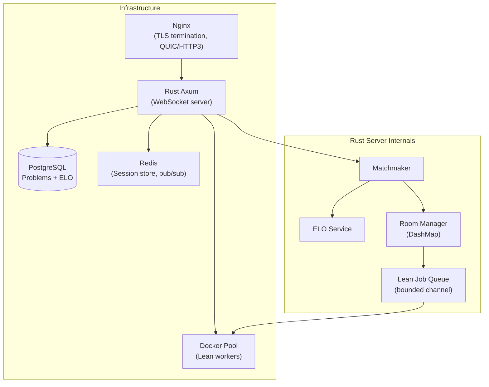

# ProofBattle — Engineering & Architecture Design Document

> **Perspective**: Written as both a mathematics researcher and systems engineer, treating this as a serious, production-bound competitive platform for formal proof verification.

---

## Table of Contents

1. [What Is Wrong Right Now](#1-what-is-wrong-right-now)
2. [Proof Generation & Verification Pipeline](#2-proof-generation--verification-pipeline-diagram)
3. [Redesigned Architecture](#3-redesigned-architecture)
4. [Transport Layer: WebSocket vs WebRTC vs QUIC](#4-transport-layer-websocket-vs-webrtc-vs-quic)
5. [Sourcing Proofs at Scale](#5-sourcing-proofs-at-scale)
6. [Rust Code Practices](#6-rust-code-practices)
7. [UI/UX Design](#7-uiux-design)
8. [Final Checklist](#8-final-checklist)

---

## 1. What Is Wrong Right Now

### 🔴 Critical Issues

#### 1.1 — Lean is Invoked as a Blocking Subprocess on the Async Runtime

```rust
// lean_runner.rs — CURRENT (broken)
let output = Command::new("lake")
    .arg("env").arg("lean")
    .arg(format!("proofs/{}", filename))
    .output();  // ← std::process::Command BLOCKS the thread

sleep(Duration::from_secs(2)); // ← hardcoded sleep on top of it
```

**The problem**: `std::process::Command::output()` is synchronous. It blocks the OS thread it runs on. Since Tokio's async runtime uses a thread pool, blocking one thread here means one less thread to serve other WebSocket connections. With 10 concurrent games, you are burning 10 threads just sitting and waiting for `lake`. Plus the **2-second `sleep()`** is completely arbitrary — it solves nothing and wastes time.

**Fix**: Use `tokio::process::Command` (async) with a configurable timeout.

```rust
// CORRECT
use tokio::process::Command;
use tokio::time::{timeout, Duration};

pub async fn run_proof(code: &str, filename: &str) -> Result<String, String> {
    let path = format!("proofs/{}", filename);
    tokio::fs::write(&path, code).await.map_err(|e| e.to_string())?;

    let result = timeout(Duration::from_secs(30), async {
        Command::new("lake")
            .arg("env").arg("lean")
            .arg(&path)
            .output()
            .await
    }).await;

    match result {
        Err(_) => Err("Proof verification timed out (30s)".into()),
        Ok(Err(e)) => Err(format!("Failed to spawn Lean: {e}")),
        Ok(Ok(output)) => {
            if output.status.success() {
                Ok(String::from_utf8_lossy(&output.stdout).into())
            } else {
                Err(String::from_utf8_lossy(&output.stderr).into())
            }
        }
    }
}
```

---

#### 1.2 — No Timeout on Proof Verification = Denial of Service

Any player can submit an infinite loop or a proof that takes 10 minutes. There is **zero timeout**. The server will hang forever processing it. This is a critical DoS vector.

**Fix**: Wrap `run_proof` in `tokio::time::timeout(Duration::from_secs(30), ...)`.

---

#### 1.3 — Proof Files Are Written to Disk Without Sandboxing

```rust
let path = format!("proofs/{}", filename); // filename = player_id + "_proof.lean"
```

`player_id` is a UUID generated server-side, so this is safe *for now*. But there is no validation on the `code` string itself. A player could submit:
```lean
#eval System.Process.run { cmd := "rm", args := #["-rf", "/"] }
```
Lean evaluates `#eval` at check time. This is **arbitrary code execution on your server**.

**Fix**:
1. Strip or reject any `#eval`, `#check`, `#print`, `unsafe`, `IO` calls from submitted code before writing to disk.
2. Run `lake env lean` inside a sandboxed environment (Docker container with no network, read-only filesystem except `/tmp`).
3. Use Linux `seccomp` or `bubblewrap` to restrict syscalls.

---

#### 1.4 — Global Mutex on `challenge_map` Blocks Everything

```rust
let challenge_map: Arc<Mutex<HashMap<String, ProofChallenge>>> = ...
// On every proof submission:
let map = challenge_map.lock().await; // ← ALL connections pause here
```

A single `tokio::sync::Mutex` wrapping the entire challenge map means every single WebSocket connection competes for the same lock on every proof submission.

**Fix**: Use `DashMap` (a sharded concurrent HashMap) — zero lock contention for different keys:

```rust
use dashmap::DashMap;
let challenge_map: Arc<DashMap<String, ProofChallenge>> = Arc::new(DashMap::new());
// No .lock() needed — DashMap handles sharding internally
let challenge = challenge_map.get(&player_id).map(|r| r.clone());
```

---

#### 1.5 — `player_id` Is Sent by the Client (Trust Issue)

```rust
// message.rs
pub enum ClientMessage {
    SubmitProof { code: String, player_id: String }, // ← CLIENT sends their own ID
}
```

The client tells the server who they are. A malicious player can send another player's `player_id` and steal their win, or invalidate their challenge slot. **Never trust the client for identity.**

**Fix**: The server assigns the `player_id` at WebSocket connection time and associates it with the TCP stream handle. The client never sends it — the server already knows who is sending.

---

#### 1.6 — No Reconnection Logic

If a player's tab refreshes or their connection drops, there is no way to rejoin an ongoing game. The room is orphaned, the opponent is stuck indefinitely, and no `GameEnded` or `Error` is ever sent.

**Fix**: Implement session tokens. On `Joined`, send a session token. If a client reconnects with a valid token within N seconds, restore them to their room.

---

#### 1.7 — Only 3 Proof Problems. Hardcoded in Source.

```rust
pub fn get_problems() -> Vec<ProofChallenge> {
    vec![
        ProofChallenge { goal: "∀ n : ℕ, n + 0 = n" ... },
        ProofChallenge { goal: "∀ a b : ℕ, a + b = b + a" ... },
        ProofChallenge { goal: "∀ P Q : Prop, P ∧ Q → Q ∧ P" ... },
    ]
}
```

Three problems. Players will exhaust these in minutes. They also live inside compiled binary — you cannot update them without redeploying.

---

#### 1.8 — The Frontend is a 28-Line Debug Page

```html
<h1>WebSocket Client</h1>
<script>
const socket = new WebSocket("ws://localhost:3000/ws");
socket.onopen = () => { socket.send("hello"); };
```

This is a dev test harness, not a product.

---

#### 1.9 — Room Cleanup Never Happens

Rooms in `mm.rooms` and `mm.match_states` are created but **never removed** after a game ends. Memory grows without bound. After 10,000 games the server OOMs.

---

#### 1.10 — `tokio-tungstenite` + `axum` WS Duplication

`Cargo.toml` lists both `tokio-tungstenite` and `axum` with `ws` feature. Axum already wraps tungstenite internally. The standalone `tokio-tungstenite` dependency is unused and just bloats the binary.

---

## 2. Proof Generation & Verification Pipeline Diagram

```mermaid
flowchart TD
    subgraph OFFLINE["⚙️ Offline Pipeline (Scheduled Job)"]
        ML["Mathlib4 Repository\n(GitHub / local clone)"]
        PA["Proof Analyzer\n(Rust CLI / Python script)"]
        DB[("PostgreSQL\nProblems DB")]
        ML -->|Parse .lean files\nExtract theorem statements| PA
        PA -->|Categorize by:\n- difficulty\n- topic\n- tactic used| DB
    end

    subgraph CLIENT["🖥️ Client Browser"]
        P1["Player 1\nLean Editor"]
        P2["Player 2\nLean Editor"]
    end

    subgraph SERVER["🦀 Rust Axum Server"]
        WS["WebSocket Handler\n/ws"]
        MM["Matchmaker\n(in-memory)"]
        PS["Problem Selector\n(by ELO bracket)"]
        LQ["Lean Job Queue\n(tokio mpsc channel)"]
    end

    subgraph LEAN_WORKERS["🔬 Lean Worker Pool (Isolated)"]
        W1["Worker 1\n(Docker container)"]
        W2["Worker 2\n(Docker container)"]
        W3["Worker 3\n(Docker container)"]
        LS["lake env lean\n(with seccomp sandbox)"]
    end

    P1 -->|WebSocket connect| WS
    P2 -->|WebSocket connect| WS
    WS --> MM
    MM -->|2 players ready| PS
    PS -->|Query by difficulty| DB
    PS -->|Send Challenge msg\n{goal, hint, difficulty}| P1
    PS -->|Send Challenge msg\n{goal, hint, difficulty}| P2

    P1 -->|SubmitProof {code}| WS
    P2 -->|SubmitProof {code}| WS
    WS -->|Enqueue job| LQ
    LQ -->|Dispatch to free worker| W1
    LQ -->|Dispatch to free worker| W2
    W1 --> LS
    W2 --> LS
    LS -->|stdout/stderr| W1
    W1 -->|ProofResult {success, output}| WS
    WS -->|Winner first correct = GameEnded| P1
    WS -->|GameEnded {winner}| P2

    style OFFLINE fill:#1a1a2e,color:#e0e0ff
    style SERVER fill:#16213e,color:#e0e0ff
    style LEAN_WORKERS fill:#0f3460,color:#e0e0ff
    style CLIENT fill:#533483,color:#ffffff
```

---

### Verification Flow (Step by Step)

```
Player submits:
  "intro n; simp"

Server wraps it:
  import Mathlib.Data.Nat.Basic

  theorem goal : ∀ n : ℕ, n + 0 = n := by
    intro n
    simp

Written to: /sandbox/proofs/<uuid>.lean

Sandboxed process:
  lake env lean /sandbox/proofs/<uuid>.lean

If exit code = 0  → success = true  → declare winner
If exit code ≠ 0  → success = false → return stderr to player
If timeout (30s)  → success = false → return "Timed out"
```

---

## 3. Redesigned Architecture



### Key Architectural Decisions

| Concern | Current | Recommended |
|---|---|---|
| Lean execution | `std::process::Command` (blocking) | `tokio::process::Command` + bounded worker pool |
| Shared state | `Arc<Mutex<HashMap>>` | `DashMap` + Redis for cross-instance |
| Problem storage | Hardcoded in binary | PostgreSQL with category + difficulty tags |
| Identity | Client-provided `player_id` | Server-assigned, bound to TCP stream |
| Sandboxing | None | Docker + seccomp profile |
| Reconnection | None | Redis session tokens (60s TTL) |
| ELO / ranking | None | Glicko-2 rating system |
| Timeout | None | `tokio::time::timeout(30s)` |
| Room cleanup | Never | Drop room on GameEnded + disconnect |

---

### Lean Worker Pool Design

Instead of spawning a `lake env lean` process per request (cold start: ~5-15 seconds per invocation due to Lean's compilation overhead), maintain a **pre-warmed pool** of persistent Lean Language Server processes:

```rust
// Pseudocode concept
struct LeanWorkerPool {
    workers: Vec<LeanWorker>,      // pre-forked, pre-warmed
    queue: mpsc::Sender<ProofJob>, // bounded to prevent backlog
}

struct ProofJob {
    code: String,
    respond_to: oneshot::Sender<ProofResult>,
}
```

Each worker:
1. Is a long-running Docker container with Mathlib pre-compiled (`.olean` cache warmed)
2. Accepts jobs via stdin/stdout or Unix socket
3. Returns results in < 2s for simple proofs (vs ~15s cold start)

> [!IMPORTANT]
> Mathlib compilation cold takes **20+ minutes**. The `.lake/build` cache MUST be mounted as a volume. Never build from scratch per container.

---

## 4. Transport Layer: WebSocket vs WebRTC vs QUIC

### Current: Plain WebSocket over TCP

WebSocket over TCP is fine for this use case, but has one problem: **head-of-line blocking**. If a TCP packet is dropped, all subsequent messages are held up waiting for retransmission, even if they are independent.

### Recommendation: WebSocket over QUIC (HTTP/3)

```
Browser ─── QUIC/HTTP3 ──► Nginx ──► Rust (internal WebSocket over TCP is fine here)
```

QUIC eliminates head-of-line blocking at the transport level. For real-time collaborative experiences where you are streaming Lean error messages back to the player as they type, this matters significantly.

**Nginx QUIC config**:
```nginx
listen 443 quic reuseport;
listen 443 ssl;
http3 on;
add_header Alt-Svc 'h3=":443"; ma=86400';
```

### Why NOT WebRTC for this project

WebRTC is designed for **peer-to-peer** media (audio, video, data channels). For a client-server proof verification game:
- The proof must be verified by the **server** (not the peer) — you cannot trust the other player to verify proofs
- WebRTC adds significant complexity (ICE, STUN, TURN, SDP negotiation) for zero benefit
- Stick with WebSocket; use QUIC at the transport layer if latency is critical

### Live Feedback: Streaming Lean Errors

For the "as you type" Lean feedback (like VS Code's Lean extension), consider:
```
Player types → debounce 500ms → send partial code via WebSocket
Server spawns lightweight `lean --server` LSP process per session
Streams back `{ type: "LspDiagnostic", line: 3, message: "unknown tactic" }`
```

This requires a **persistent Lean LSP process per player** during the game (not spawning fresh per submission). Memory-intensive but gives a VS Code-like experience.

---

## 5. Sourcing Proofs at Scale

### Source 1: Mathlib4 Theorem Extraction (Best Source)

Mathlib4 contains **~70,000+ theorems**. Most are usable as challenges.

```bash
# Extract all theorem statements from Mathlib
grep -rn "^theorem \|^lemma " mathlib4/Mathlib/ \
  | grep -v "sorry" \
  | awk -F: '{print $1, $3}' \
  > raw_theorems.txt
```

Write a Lean script to extract them with full metadata:

```lean
-- extract_theorems.lean
import Mathlib
open Lean in
#eval do
  let env ← getEnv
  let theorems := env.constants.toList.filter (fun (_, ci) =>
    ci.isTheorem && !ci.name.isInternal)
  for (name, ci) in theorems do
    IO.println s!"{name} : {ci.type}"
```

Then categorize by:
- **Namespace**: `Nat.*`, `Real.*`, `Finset.*`, `Logic.*`
- **Tactic used** in proof: `simp`, `ring`, `norm_num`, `omega`, `linarith`
- **Proof length**: short proofs = easier challenges

Store in PostgreSQL:
```sql
CREATE TABLE problems (
    id UUID PRIMARY KEY DEFAULT gen_random_uuid(),
    goal TEXT NOT NULL,
    imports TEXT[] NOT NULL,
    difficulty SMALLINT CHECK (difficulty BETWEEN 1 AND 10),
    category TEXT,          -- 'nat_arithmetic', 'logic', 'real_analysis'
    tactic_hint TEXT,       -- 'try simp or omega'
    source_theorem TEXT,    -- 'Nat.add_comm'
    verified BOOLEAN DEFAULT false,
    created_at TIMESTAMPTZ DEFAULT now()
);

CREATE INDEX ON problems (difficulty, category);
```

### Source 2: Lean4 Natural Number Game

The [Natural Number Game](https://adam.math.hhu.de/) has ~100 curated beginner proof challenges with beautiful pedagogical progression. These are ideal for ELO 0-800 players.

### Source 3: CompetitionMath → Lean (AI-Assisted)

Use an AI pipeline to convert competition math (IMO, Putnam) statements into Lean:
```
[IMO 2023 Problem 1] ─► GPT-4 ─► Lean theorem statement ─► verify with `#check`
```

Filter only those where `#check` passes (syntactically valid) and a known proof exists.

### Source 4: Lean4 Examples Repository

`leanprover/lean4` and `leanprover-community/lean4-samples` contain hundreds of worked examples.

### Difficulty Calibration

```
ELO 0–600    → `omega`, `decide`, `simp` one-liner proofs
ELO 600–1000 → `ring`, `norm_num`, 2-3 tactic proofs  
ELO 1000–1400 → `linarith`, `nlinarith`, induction
ELO 1400+    → multi-step with `have`, `obtain`, `cases`
```

---

## 6. Rust Code Practices

### 6.1 — Module Structure (Recommended)

```
src/
├── main.rs            ← server bootstrap only
├── config.rs          ← Config struct (from env vars)
├── ws/
│   ├── mod.rs         ← WebSocket upgrade handler
│   ├── handler.rs     ← per-connection loop
│   └── message.rs     ← ClientMessage / ServerMessage
├── game/
│   ├── mod.rs
│   ├── matchmaker.rs  ← Matchmaker
│   ├── room.rs        ← GameRoom, Match
│   └── elo.rs         ← ELO/Glicko-2 rating
├── lean/
│   ├── mod.rs
│   ├── runner.rs      ← async Lean subprocess
│   ├── sandbox.rs     ← input sanitization
│   └── pool.rs        ← worker pool
├── db/
│   ├── mod.rs
│   └── problems.rs    ← fetch problems from Postgres
└── error.rs           ← AppError type
```

### 6.2 — Error Handling

Replace `unwrap()` everywhere with proper error propagation:

```rust
// CURRENT — crashes on any error
tx.send(msg_json.clone()).unwrap();

// CORRECT
if tx.send(msg_json.clone()).is_err() {
    tracing::warn!(player_id = %pid, "Client disconnected before message delivery");
    return; // gracefully exit this connection's task
}
```

### 6.3 — Structured Logging

Replace `println!()` with `tracing`:

```rust
// Cargo.toml
tracing = "0.1"
tracing-subscriber = { version = "0.3", features = ["env-filter"] }

// main.rs
tracing_subscriber::fmt()
    .with_env_filter("proof_battle=debug,tower_http=info")
    .init();

// Usage
tracing::info!(room_id = %room_id, winner = %player_id, "Game ended");
tracing::error!(player_id = %pid, err = %e, "Lean runner failed");
```

### 6.4 — Configuration via Environment Variables

```rust
// config.rs
use std::env;

pub struct Config {
    pub bind_addr: String,
    pub lean_timeout_secs: u64,
    pub max_lean_workers: usize,
    pub database_url: String,
    pub redis_url: String,
}

impl Config {
    pub fn from_env() -> Self {
        Self {
            bind_addr: env::var("BIND_ADDR").unwrap_or("127.0.0.1:3000".into()),
            lean_timeout_secs: env::var("LEAN_TIMEOUT").ok()
                .and_then(|v| v.parse().ok()).unwrap_or(30),
            max_lean_workers: env::var("LEAN_WORKERS").ok()
                .and_then(|v| v.parse().ok()).unwrap_or(4),
            database_url: env::var("DATABASE_URL").expect("DATABASE_URL required"),
            redis_url: env::var("REDIS_URL").unwrap_or("redis://localhost:6379".into()),
        }
    }
}
```

### 6.5 — Input Sanitization for Lean Code

```rust
// lean/sandbox.rs
const FORBIDDEN_PATTERNS: &[&str] = &[
    "#eval", "#check IO", "unsafe", "System.Process",
    "IO.Process", "Lean.Environment", "@[extern",
    "native_decide",  // can call arbitrary native code
];

pub fn sanitize_lean_code(code: &str) -> Result<String, String> {
    for pattern in FORBIDDEN_PATTERNS {
        if code.contains(pattern) {
            return Err(format!("Forbidden construct: `{pattern}`"));
        }
    }
    if code.len() > 4096 {
        return Err("Proof too long (max 4096 chars)".into());
    }
    Ok(code.to_string())
}
```

### 6.6 — Room Lifecycle Management

```rust
impl Matchmaker {
    pub fn cleanup_room(&mut self, room_id: &str) {
        self.rooms.remove(room_id);
        self.match_states.remove(room_id);
        tracing::debug!(room_id, "Room cleaned up");
    }
}

// In handle_socket, after GameEnded:
{
    let mut mm = matcher.lock().await;
    mm.cleanup_room(&room_id);
}
```

---

## 7. UI/UX Design

### Layout: Three-Panel Split

```
┌─────────────────────────────────────────────────────────────┐
│  🏆 ProofBattle          [Timer: 4:32]    👤 You vs opponent │
├───────────────────┬─────────────────────┬───────────────────┤
│                   │                     │                   │
│  📜 PROBLEM       │  📝 YOUR EDITOR     │  📊 LIVE STATUS   │
│                   │                     │                   │
│  Prove:           │  theorem goal :     │  YOU             │
│  ∀ n : ℕ,        │    ∀ n : ℕ,        │  ⏳ Checking...   │
│    n + 0 = n      │      n + 0 = n := by│                   │
│                   │    intro n          │  OPPONENT         │
│  Difficulty: ★☆☆  │    simp ▌           │  ✏️ Typing...     │
│                   │                     │                   │
│  💡 Hint:         │  ┌──────────────┐  │  ─────────────   │
│  Try `simp`       │  │ ✅ No errors  │  │  ⚡ 2 submissions  │
│  or `omega`       │  └──────────────┘  │  both failed      │
│                   │                     │                   │
│                   │  [Submit Proof]     │                   │
└───────────────────┴─────────────────────┴───────────────────┘
```

### Core UX Principles

1. **Lean Editor with Monaco** (same as VS Code): syntax highlighting, Unicode input (type `->` get `→`), line numbers. Use `monaco-editor` npm package.

2. **Live Error Feedback**: Stream LSP diagnostics as the player types (debounced 800ms). Red squiggles on bad lines. This is what makes it feel like real Lean, not a textarea.

3. **Opponent Activity Indicator**: Show "opponent is typing..." (derived from WebSocket heartbeat, not actual code). Never show opponent's code — that would allow cheating.

4. **Countdown Timer**: Configurable per difficulty. Beginner: 10 min. Expert: 5 min. When timer hits 0 with no winner → draw.

5. **Submission Feedback Loop**:
   - Submit → show spinner "Verifying with Lean..." (avg 2-8s)
   - ✅ Green flash → "Proof Accepted! You win!" + confetti
   - ❌ Red flash → show exact Lean error message (educational)

6. **Post-Game Screen**:
   - Show the winning proof
   - "What was the intended solution?" (canonical short proof)
   - ELO delta: `+24 rating points`
   - "Rematch" / "New Opponent" / "Practice Mode"

### Tech Stack for Frontend

```
Framework:     SvelteKit (lightweight, fast, excellent TS)
Editor:        Monaco Editor (Lean syntax highlighting via TextMate grammar)
WebSocket:     Native browser WebSocket API (no library needed)
Styling:       Tailwind CSS + custom dark math theme
Math rendering: KaTeX (render proof goals as LaTeX)
State:         Svelte stores (no Redux complexity needed)
Build:         Vite
```

### Unicode / LaTeX Rendering

The goal `∀ n : ℕ, n + 0 = n` should render beautifully:

```
Display: ∀ n : ℕ, n + 0 = n
KaTeX:   \forall n : \mathbb{N},\ n + 0 = n
```

Use KaTeX to render the goal statement in the problem panel. The editor panel uses raw Unicode (Lean's native syntax).

---

## 8. Final Checklist

### Security
- [ ] Sanitize submitted Lean code (block `#eval`, `unsafe`, `IO`)
- [ ] Run Lean in Docker with seccomp, no network, read-only FS
- [ ] Server assigns player identity — never trust client-provided IDs
- [ ] Rate limit proof submissions (max 5/min per player)
- [ ] TLS on all connections

### Correctness
- [ ] Async Lean runner with configurable timeout
- [ ] Replace `Arc<Mutex<HashMap>>` with `DashMap`
- [ ] Remove hardcoded `sleep(2)`
- [ ] Room cleanup after game ends
- [ ] Handle opponent disconnect gracefully (timeout → forfeit)

### Scale
- [ ] Pre-warmed Lean worker pool (not cold-spawn per submission)
- [ ] PostgreSQL for problems (not hardcoded)
- [ ] Redis for session state (enables horizontal scaling)
- [ ] Bounded job queue (reject when full, don't let memory grow)

### Product
- [ ] ELO / Glicko-2 rating system
- [ ] Difficulty-matched problems (not random)
- [ ] 1000+ proof problems from Mathlib4
- [ ] Monaco editor with Lean syntax highlighting
- [ ] Live error feedback (LSP streaming)
- [ ] Reconnection with session tokens
- [ ] Post-game analysis screen

### Developer Experience
- [ ] Replace all `unwrap()` with proper error handling
- [ ] `tracing` structured logging (not `println!`)
- [ ] Config via environment variables
- [ ] Modular file structure (not all in `main.rs`)
- [ ] Integration tests for the proof verification pipeline

---

> **Bottom line**: The core idea is excellent and the skeleton is correct. The proof submission → Lean verification → winner declaration loop works. What's missing is everything around it: safety, scale, correctness under failure, and a real user interface. Fix the async blocker and the security sandbox first — those are the two that will burn you immediately in production.
